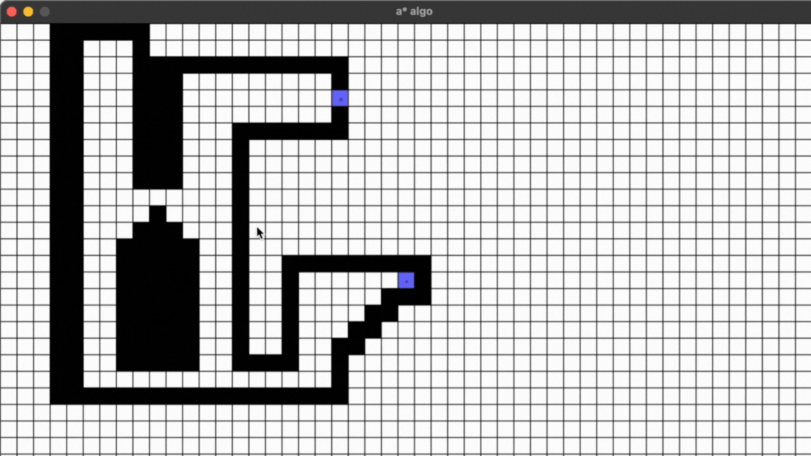
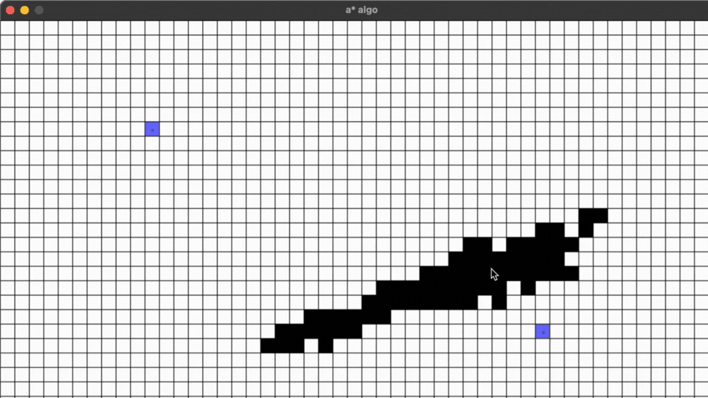
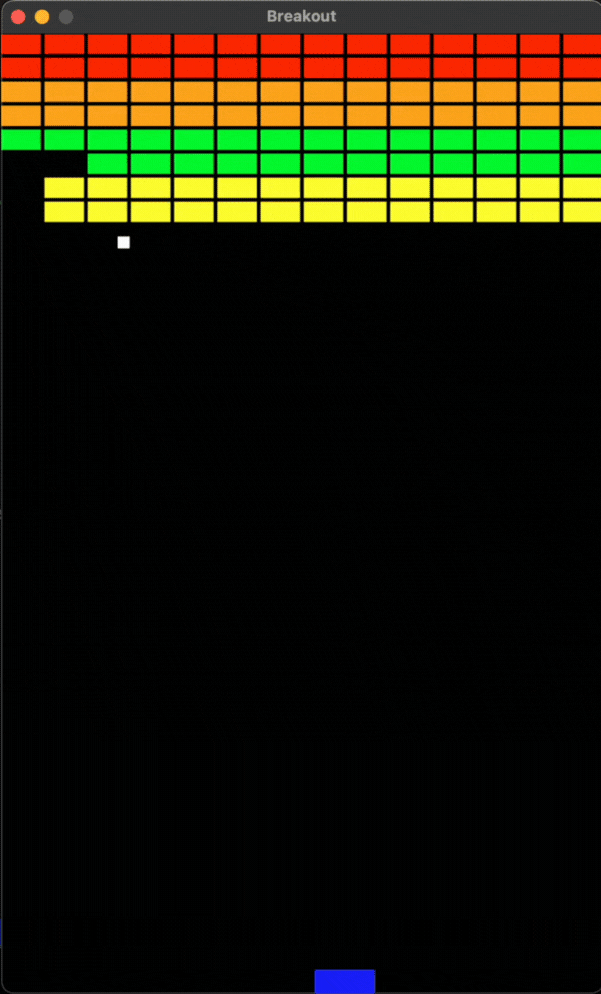
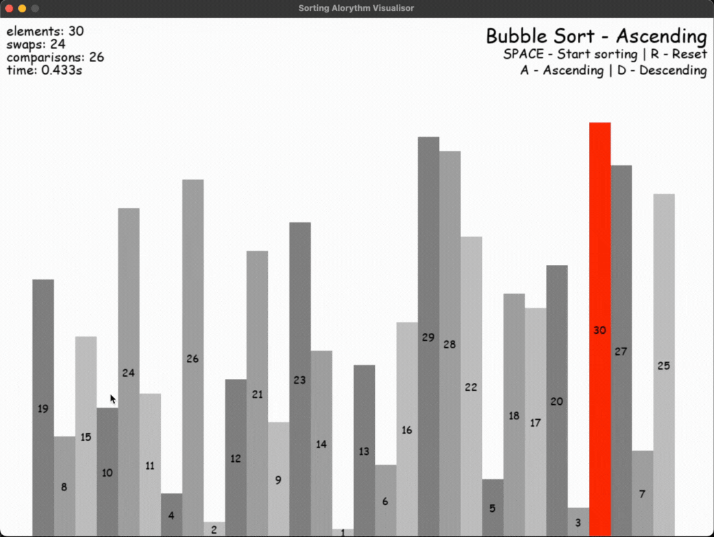
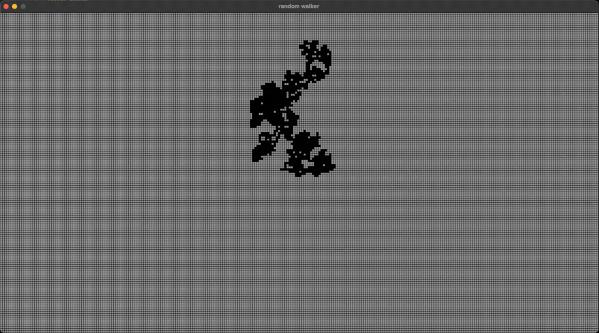

# __My first personal Python visualization projects using `pygame`__  
## Done: __February/March 2022__  
# __1. A* Pathfinding__

    
    

# __2. Atari Breakout__  

    

# __3. Bubblesort__  

    

# __4. Game of Life__  

    

# __5. Random Walker__  

    

